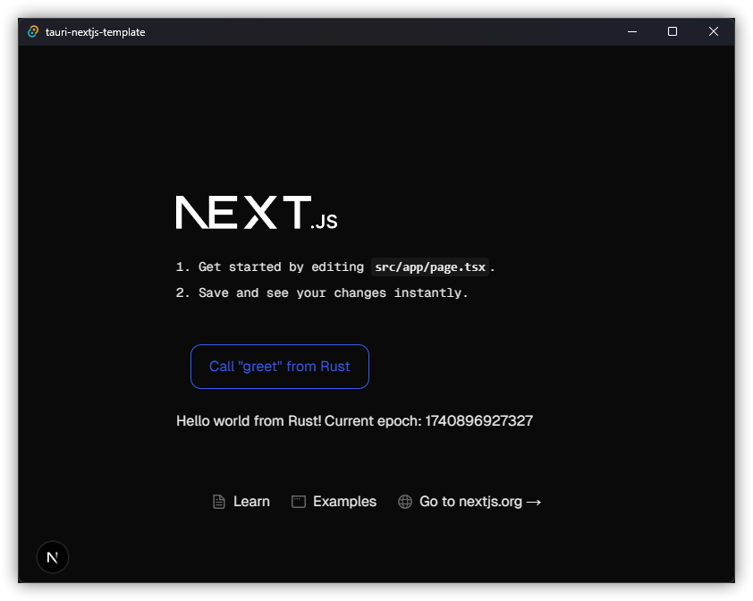

# K-Manager - Gestionnaire de mots de passe local



K-Manager est une application de gestion de mots de passe **locale et sécurisée**, conçue pour vous aider à stocker et organiser vos identifiants en toute sécurité sur votre propre machine.

## 🔒 Pourquoi K-Manager ?

- **100% local** : Vos données restent sur votre machine, sans stockage dans le cloud
- **Open Source** : Code transparent et vérifiable
- **Multiplateforme** : Fonctionne sur Windows, macOS et Linux
- **Interface moderne** : Basé sur Next.js 15 et Tauri 2.0
- **Sécurité renforcée** : Chiffrement des données sensibles

## 📦 Installation

### Prérequis
- Node.js (version 18 ou supérieure)
- Rust (pour la compilation Tauri)
- pnpm (gestionnaire de paquets)

### Étapes d'installation

1. Clonez le dépôt :
```bash
git clone https://github.com/aydansoupama/k-manager.git
cd k-manager
```

2. Installez les dépendances :
```bash
pnpm install
```

4. Lancez l'application en mode développement :
```bash
pnpm tauri dev
```

5. Pour construire une version de production :
```bash
pnpm tauri build
```

## 🚀 Fonctionnalités

### Gestion des mots de passe
- Stockage sécurisé des identifiants
- Générateur de mots de passe forts
- Catégorisation des comptes
- Recherche instantanée

### Sécurité
- Chiffrement AES-256 des données sensibles
- Verrouillage automatique après inactivité
- Protection par mot de passe principal
- Pas de transmission de données vers des serveurs externes

### Interface utilisateur
- Design moderne et intuitif
- Mode sombre intégré
- Adapté aux écrans de toutes tailles
- Navigation simple et efficace

## 🛠️ Technologie

K-Manager utilise les technologies suivantes :

- **Frontend** : Next.js 15 (App Router) avec TypeScript
- **Backend** : Tauri 2.0 (Rust)
- **Styling** : Tailwind CSS 4
- **Gestion d'état** : React Context
- **Stockage** : Base de données locale chiffrée
- **Linting/Formatage** : Biome + ESLint

## 🔐 Sécurité et Vie privée

Vos données sont **exclusivement stockées localement** et chiffrées avec :
- Algorithme AES-256 pour le chiffrement des mots de passe
- Fonction de dérivation de clé PBKDF2
- Protection contre les attaques par force brute
- Aucune connexion internet requise pour l'utilisation basique

## 📸 Captures d'écran


*Plus de captures disponibles dans le dossier `/public`*

## 🤝 Contribution

Les contributions sont les bienvenues ! Voici comment participer :

1. Forkez le projet
2. Créez une branche pour votre fonctionnalité (`git checkout -b feature/AmazingFeature`)
3. Commitez vos changements (`git commit -m 'Add some AmazingFeature'`)
4. Poussez vers la branche (`git push origin feature/AmazingFeature`)
5. Ouvrez une Pull Request

## 📜 Licence

Ce projet est sous licence MIT - voir le fichier [LICENSE](LICENSE) pour plus de détails.

## ❓ FAQ

**Q: Mes mots de passe sont-ils vraiment en sécurité ?**
R: Oui, tous vos données sont chiffrées localement avec AES-256 et ne quittent jamais votre machine.

**Q: Puis-je synchroniser mes données entre plusieurs appareils ?**
R: Actuellement, K-Manager est conçu pour un usage local uniquement. Une fonctionnalité de synchronisation sécurisée pourrait être ajoutée dans le futur.

**Q: Que se passe-t-il si j'oublie mon mot de passe principal ?**
R: Sans le mot de passe principal, il est impossible de déchiffrer vos données. Assurez-vous de le mémoriser ou de le stocker en lieu sûr.

## 📬 Contact

Pour toute question ou suggestion, vous pouvez :
- Ouvrir une issue sur GitHub
- Contacter le mainteneur principal : [@aydansoupama](https://github.com/aydansoupama)

---
© 2025 K-Manager. Tous droits réservés.
